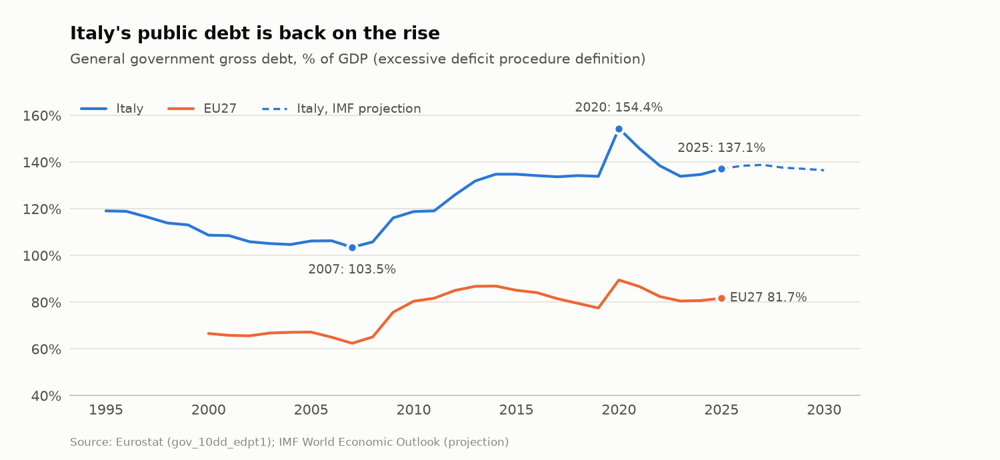
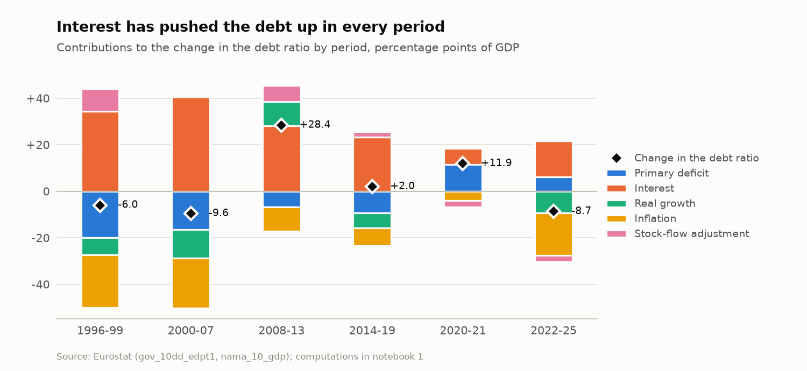
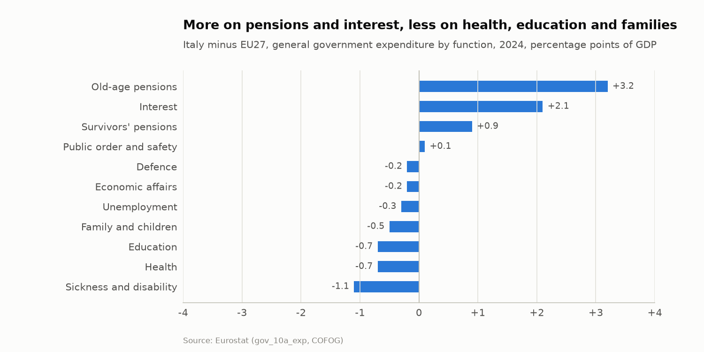
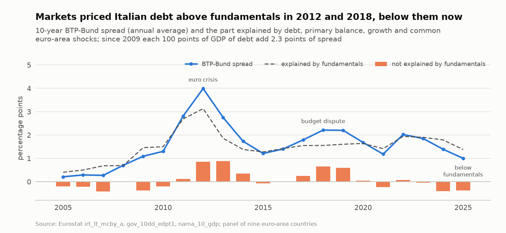
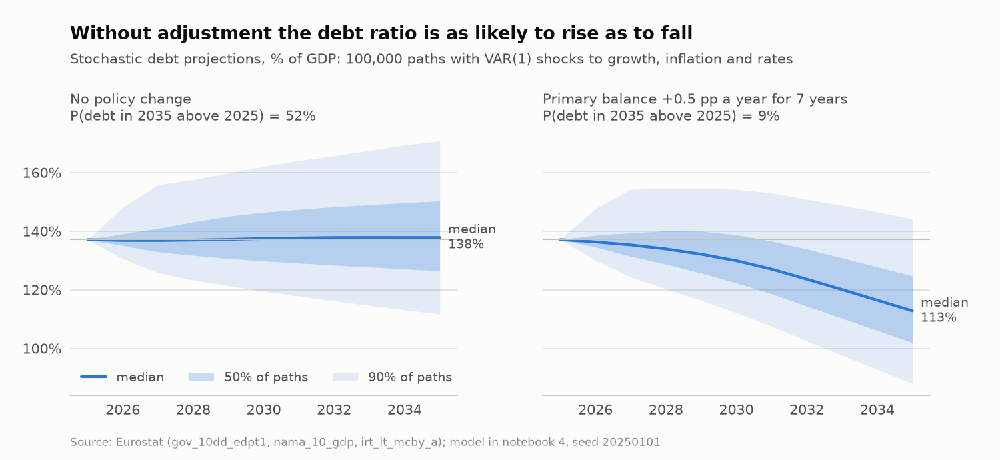

# Italian Public Debt


**Why Italy's public debt is so high, how to read the public accounts, and what it would take to reduce the debt: an evidence-based analysis with official Eurostat and IMF data, Python notebooks and a C++ engine for stochastic debt sustainability.**

Italy's general government debt was 137.1% of GDP in 2025, the second highest in the euro area. This repository reconstructs how it was built, measures the role of primary deficits, interest rates, growth and inflation, compares the structure of spending and revenues with Germany, France, Spain and the EU, analyses the macroeconomic and microeconomic causes of weak growth, and quantifies the options to put the debt ratio on a durably declining path.

## What the data show

Figures computed in the notebooks from Eurostat data (excessive deficit procedure notification and national accounts, downloaded in September 2026) unless stated otherwise.

- **Where the debt stands.** After the pandemic peak (154.4% of GDP in 2020) strong nominal growth brought the ratio down to 133.9% in 2023; it is rising again (134.7% in 2024, 137.1% in 2025) although the primary balance is back in surplus (0.8% of GDP). Interest spending is 3.9% of GDP, twice the EU average, and the building tax credits granted in 2021-2023 are now being used against taxes: they raise the debt without affecting the deficit (stock-flow adjustments of +1.0 and +2.6 points of GDP in 2024 and 2025).
- **The debt was built mainly in the 1970s and 1980s** (Bank of Italy long-run series): spending commitments grew without matching revenues and, after the 1981 end of monetary financing, real interest rates exceeded growth while primary deficits persisted for a decade. The ratio rose from about 57% of GDP in 1980 to about 120% in 1994.
- **Since the 1990s the snowball, not the primary balance, has driven the debt.** The primary balance exceeded its debt-stabilising level in 20 of the 30 years since 1996. In 2008-2013 the ratio rose by 28 points: primary surpluses lowered it by 7 points, but interest added 28 and the recessions 10.
- **Missed opportunities** (mechanical counterfactuals, without feedback effects): keeping the 1997-2000 primary surplus (4.8% of GDP) during the low-rate years 2001-2007 would give a 2025 ratio of about 110% instead of 137%; growing like the EU27 since 2001 about 109%; holding the 2020-2023 primary balance at its 2019 level about 113%; an effective interest rate one point lower since 2012 about 120%.
- **Budget structure** (COFOG 2024, % of GDP): old-age pensions 13.9 against 10.7 in the EU, interest 4.0 against 1.9; less than the EU on education (4.0 against 4.7), health (6.6 against 7.3) and family benefits (1.5 against 2.0).
- **Fiscal policy has not reacted systematically to debt**: in a Bohn (1998) regression on 1996-2025 the response of the primary balance to the debt ratio is not positive in any specification (full sample, pandemic and tax-credit dummies, pre-pandemic sample).
- **Growth is the missing ingredient**: real GDP grew by 0.4% a year in 2001-2025 against 1.4% in the EU27. The employment rate (20-64) is 67.6% against 76.1% in the EU, 58.0% against 71.3% for women; R&D spending is 1.4% of GDP against 2.2%. Closing the employment gap over ten years would bring the ratio to about 114% in 2035 instead of about 136%.
- **Little fiscal space, and markets watch debt more than before 2008.** In a panel of 12 advanced EU economies (1996-2025, country and year effects) primary balances respond more strongly to debt between about 56% and 127% of GDP and less beyond: Italy is past that fatigue point. On this average behaviour Italy's debt limit is about 141% of GDP at today's interest-growth differential (0.8 points), only 4 points above current debt; there is no limit above current debt if the differential widens to 1.7 points. The estimate is very sensitive to the specification: with Greece's programme years in the panel the limit rises to 229%. Euro-area spreads rise by 2.3 points per 100 points of debt since 2009, twice the earlier slope; the BTP-Bund spread exceeded fundamentals by 0.6-0.9 points in 2012-2013 and 2018-2019 and is about 0.4 points below them in 2024-2025.
- **The way out.** With no policy change the ratio stays around 136% in 2035 and the probability that it is higher than today is about 52%. A structural adjustment of 0.25 points of GDP a year for seven years brings that probability to about 25%; a package of spending review, tax compliance and growth reforms lowers the 2035 ratio by about 17 points, to about 119%. Notebook 4 compares these levers, their risks and the EU fiscal rules.

Figures before 1995 come from the Bank of Italy literature cited in the notebooks; the IMF series used for the long view starts in 1988.

## Charts

<picture>
  <source media="(prefers-color-scheme: dark)" srcset="docs/figures/debt_ratio-dark.png">
  
</picture>

<picture>
  <source media="(prefers-color-scheme: dark)" srcset="docs/figures/debt_decomposition-dark.png">
  
</picture>

<picture>
  <source media="(prefers-color-scheme: dark)" srcset="docs/figures/spending_gap-dark.png">
  
</picture>

<picture>
  <source media="(prefers-color-scheme: dark)" srcset="docs/figures/spread_fundamentals-dark.png">
  
</picture>

<picture>
  <source media="(prefers-color-scheme: dark)" srcset="docs/figures/debt_fan_chart-dark.png">
  
</picture>

The charts are drawn by `python -m public_debt.readme_figures` from the same data and engines as the notebooks (light and dark variants in `docs/figures/`).

## Catalogue

| Item | Question | Data |
| --- | --- | --- |
| [`scripts/public_debt`](scripts/public_debt/README.md) (library) | Debt accounting, fiscal analysis, growth accounting and a C++ engine for projections, fan charts and adjustment grids | Eurostat, IMF loaders |
| [1. Debt history and decomposition](notebooks/debt_dynamics/01_debt_history_and_decomposition.ipynb) | How was the debt built, which factors drove it in each period, and what if different choices had been made? | Eurostat EDP and national accounts, IMF WEO, optional Bank of Italy series since 1861 |
| [2. Reading the public accounts](notebooks/public_accounts/02_state_budget_analysis.ipynb) | Where does the money go and come from, compared with peers? How much of the deficit is structural? Has policy reacted to debt? | Eurostat government finance statistics (ESA 2010, COFOG) |
| [3. Macro and micro drivers](notebooks/growth_drivers/03_macro_micro_drivers.ipynb) | Why has Italy grown less, and what would closing the employment and productivity gaps be worth for the debt? | Eurostat national accounts, labour market, demography, R&D, bond yields |
| [4. Sustainability and policy options](notebooks/sustainability/04_debt_sustainability_and_policy_options.ipynb) | Where is the debt heading, how large an adjustment is needed, and which policy mix works best? | Eurostat, model-based scenarios |
| [5. Fiscal space and sovereign spreads](notebooks/sustainability/05_fiscal_space_and_sovereign_spreads.ipynb) | Do governments tire of adjusting at high debt, how far is Italy from its debt limit, and how much do markets charge for debt? | Eurostat EDP, national accounts and 10-year yields for 13 EU countries |
| [Guide: how to read Italy's public accounts](docs/reading_public_accounts.md) | State budget versus general government, balances, budget cycle, data sources, analysis workflow, glossary | |
| [Fiscal econometrics in R](notebooks/r_crosschecks/fiscal_econometrics_r.ipynb) (R) | Do R's econometric packages reproduce the decomposition, output gap and fiscal reaction estimates, and when did fiscal regimes change? | Eurostat `gov_10dd_edpt1`, `nama_10_gdp` |

## Architecture

```text
notebooks/  ──►  public_debt (Python)                    ──►  public_debt._core (C++17, pybind11)
                 Eurostat and IMF loaders                     debt projection with repricing of the effective rate
                 debt decomposition, counterfactuals          stochastic DSA: VAR(1) shocks with bootstrap, fiscal reaction
                 HP output gap, structural balance, Bohn      fiscal-adjustment grids (probability of rising debt)
                 growth accounting, VAR(1), EU rules checks
                 panel fiscal fatigue, debt limits, spreads
```

## Getting started

Requirements: Python 3.10 or later and a C++17 compiler. From the repository root:

```bash
python -m venv .venv
source .venv/bin/activate            # Windows PowerShell: .venv\Scripts\Activate.ps1
python -m pip install -r scripts/public_debt/requirements.txt
python -m pip install -e scripts/public_debt
python -m pytest tests/public_debt
```

Open the notebooks in Visual Studio Code (extensions *Python*, *Jupyter* and *C/C++*) in numerical order and select the `.venv` environment as kernel. Official data are downloaded and cached on first use; `PUBLIC_DEBT_DATA_MODE=synthetic` runs them offline on random placeholder data.

The notebooks are stored with the outputs of a full run on official data (September 2026), so tables and charts can be read directly on GitHub. The R notebooks in [`notebooks/r_crosschecks/`](notebooks/r_crosschecks/README.md) recompute the main results with independent R packages; they need R 4.2 or later: run `Rscript notebooks/r_crosschecks/install_packages.R` once and select the **R** kernel.

## Repository layout

```text
.
├── scripts/public_debt/   C++ engine (cpp/), Python package, build and dependency files
├── notebooks/             debt_dynamics/, public_accounts/, growth_drivers/, sustainability/, r_crosschecks/ (R)
├── docs/                  guide to the public accounts, project template, publishing workflow
├── tests/public_debt/     validation suite (pytest)
├── data/                  download cache and optional external series (ignored by Git)
└── outputs/               generated figures and tables (ignored by Git)
```

## Principles

- **Official data first**: Eurostat, ISTAT, Bank of Italy, MEF, European Commission, IMF; every dataset, perimeter and vintage is stated.
- **Facts, estimates and judgements are kept apart**: numbers computed from data, estimates from the literature (with sources) and policy assessments are labelled as such. The analysis is non-partisan: it evaluates policies by their measurable effects.
- **Reproducible and tested**: accounting identities and limiting cases are tested; simulations use fixed seeds.

## Development workflow

Changes follow the [publishing workflow](docs/publishing.md). The [`CLAUDE.md`](CLAUDE.md) file provides project instructions for [Claude Code](https://claude.com/claude-code).

## Disclaimer

Research and educational material. Projections depend on stated assumptions and are not official forecasts.

## License

Released under the [MIT License](LICENSE).
